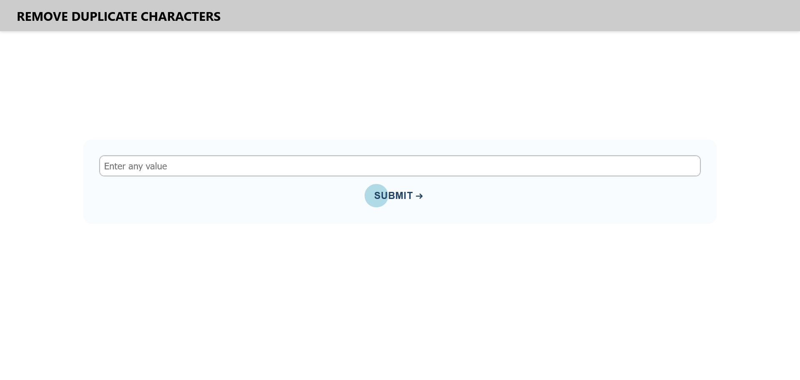
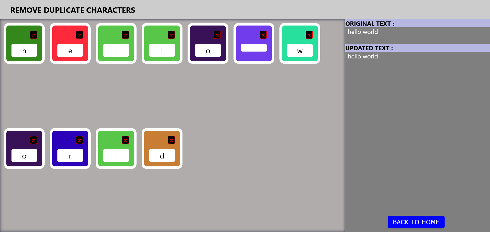
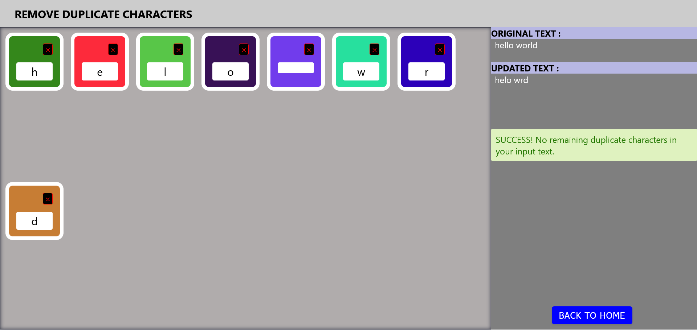

# DupeDrop

## Introduction
DupeDrop is a duplicate character remover application which is a straightforward web application that enables users to input a string of text and remove all duplicate instances of a chosen character in the string. The updated string and a visual representation of the unique characters are displayed.

This project is developed using ReactJS and comprises two screens. The first screen contains an input field and a submit button, while the second screen renders each character of the string provided by the user in the first screen as cards on the UI. Each card includes the character and a delete icon on top. When the delete icon is clicked, all other instances of the selected character in the string are removed, leaving only the clicked instance of the character on the screen.

## Quick Start Guide
### To run this project on your local machine, ensure that you have Node.js installed first.

1. Clone the repository onto your local machine.
2. Navigate to the app folder by running cd app in the project directory.
3. Install the dependencies by running npm install.
4. Start the development server by running npm start.

# Screenshots
## Screen 1

## Screen 2 (Original String)

## Screen 2 (After removing Duplicates)

# Instructions for Use
## Screen 1

1. To proceed, fill in the input field with a value that is not blank.
2. Click the "Submit" button to be taken to Screen 2.

## Screen 2

1. Remove all other occurrences of a character in the string by clicking the delete button on any character card.
2. Once all duplicates have been eliminated, a success header will appear, displaying the original string and the resulting string.
3. To return to Screen 1 with an empty input field, click the back button.

# Other Noteworthy Features of the Source Code

1. Detailed comments throughout the codebase for easier understanding and maintenance.
2. A comprehensive and clear readme file that outlines how to install and use the application.

# Libraries and Packages Utilized

1. create-react-app
2. react-router-dom
    